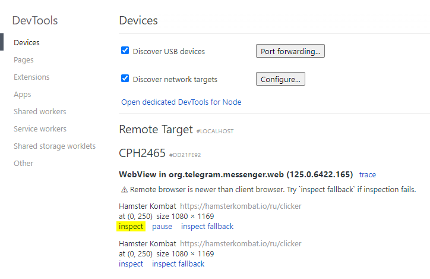
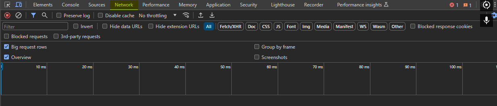
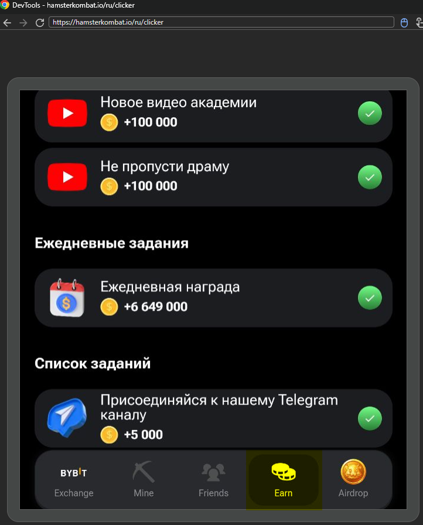
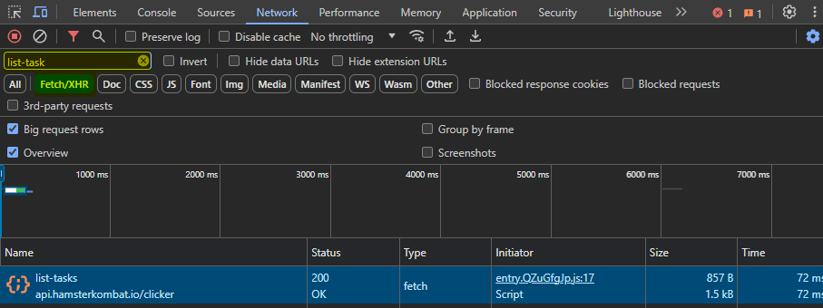
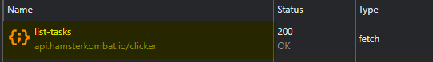
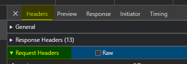
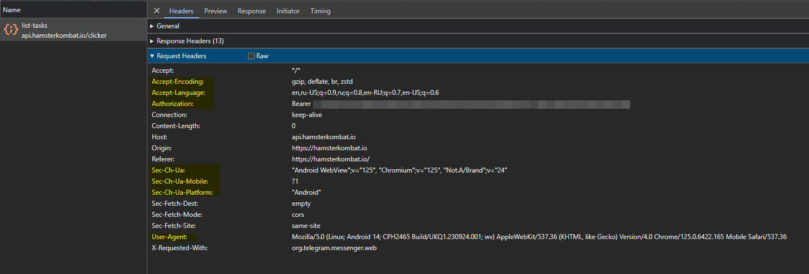

# Руководство по извлечению информации для авторизации на Android

## Шаги

### 1. Включение режима разработчика и USB отладки

1. Перейдите в **Настройки** вашего Android устройства.
2. Найдите раздел **О телефоне** или **О планшете**.
3. Несколько раз нажмите на **Номер сборки** (обычно 7 раз), пока не увидите сообщение "Вы стали разработчиком".
4. Вернитесь в **Настройки** и найдите новый раздел **Для разработчиков**.
5. Включите **Режим разработчика** и **USB отладку**.

### 2. Включение режима отладки в Telegram

1. Откройте Telegram на вашем устройстве.
2. Перейдите в **Настройки**.
3. Прокрутите вниз до самого конца и дважды долго жмите на **Версию Telegram**.
4. В появившемся меню выберите **Enable Web View Inspecting**.

### 3. Подключение устройства к ПК

1. Подключите ваше Android устройство к компьютеру с помощью USB кабеля.
2. На устройстве появится запрос на разрешение USB отладки - подтвердите его.

### 4. Открытие DevTools в Chrome

1. Откройте Google Chrome на вашем ПК.
2. В адресной строке введите `chrome://inspect/#devices` и нажмите Enter.

### 5. Дебаг Web View

1. На вашем устройстве откройте Telegram и перейдите в HamsterKombat бота.
2. В Chrome в списке устройств найдите ваше устройство и выберите любой из доступных процессов Hamster Kombat.
3. Нажмите на кнопку **inspect**.

### 6. Использование DevTools

1. Откроется отдельное окно с DevTools. Перейдите на вкладку **Network**.
2. Перейдите во вкладку **earn**, чтобы сгенерировать HTTP запрос.
3. В строке поиска введите `list-task` и выберете фильтр `Fetch/XHR`.
4. Нажмите на запрос, чтобы открыть меню взаимодействия с HTTP запросом.
5. В открывшемся окне, в разделе **Headers**, перейдите в раздел **Request Headers**.
6. Скопируйте токен в аттрибуте **Authorization:** и уберите `Bearer`, оставив лишь сам токен.
Например: `Bearer 9aFJ6C29b81cLmR04DKq7fXzQi52tHOG8e7R9vUj6iPcYwTxN0uMbA3SdV5Ks2WjMnLv8qZoJ3F1rY46tQm9` должен превратиться в `9aFJ6C29b81cLmR04DKq7fXzQi52tHOG8e7R9vUj6iPcYwTxN0uMbA3SdV5Ks2WjMnLv8qZoJ3F1rY46tQm9`.
Это и есть ваш токен.
7. Все остальные поля, выделенные желтым цветом [`Accept-Encoding`,`Accept-Language`,`Sec-Ch-Ua`,`Sec-Ch-Ua-Mobile`,`Sec-Ch-Ua-Platform`] можно использовать для генерации кастомизациии **headers** в [headers.py](bot/core/headers.py)
